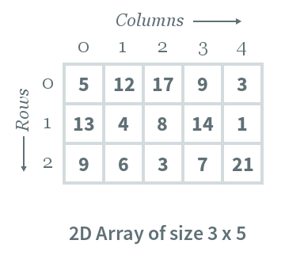

# Challenge 1

Given a Roman numeral less than `4,000`, convert it to a decimal number. This [Wikipedia article](roman-numerals) describes Roman numerals in details, but here is a brief description:

Roman numerals consist of the following symbols:

```
I is 1

V is 5

X is 10

L is 50

C is 100

D is 500

M is 1,000
```

A numeral is formed by a sequence of these symbols, where each symbol can be used up to 3 times to contribute to the total. Symbols are ordered left-to-right from larger to smaller, except for the following cases:

`I` placed before `V` or `X` indicates one less, so `4` is `IV` (one less than 5) and `9` is `IX` (one less than 10).

`X` placed before `L` or `C` indicates ten less, so 40 is `XL` (ten less than 50) and 90 is `XC` (ten less than 100).

`C` placed before `D` or `M` indicates a hundred less, so 400 is `CD` (a hundred less than 500) and `900` is `CM` (a hundred less than 1,000)

For example, 11 is `XI`, `98` is `XCVIII`, `99` is `XCIX` and 1944 is `MCMXLIV`.

[roman-numerals]: https://en.wikipedia.org/wiki/Roman_numerals


# Challenge 2

Given a 2D array A, with row m, and column n, convert all rows to columns and columns to rows.



## Example

Input:
An array of integers.

```js
[
  [5, 12, 17, 9, 3],
  [13, 4, 8, 14, 1],
  [9, 6, 3, 7, 21],
];
```

Output:
An array of integers

```js
[
  [5, 13, 9],
  [12, 4, 6],
  [17, 8, 3],
  [9, 14, 7],
  [3, 1, 21],
];
```

Constraints
1 <= m <= 10.
1 <= n <= 10.


# Challenge 3

Write a function `BinaryReversal` that takes a string parameter, which will be a positive integer.

Take its binary representation (padded to the nearest N \* 8 bits), reverse that string of bits, and then finally return the new reversed string in decimal form.

For example: if the parameter is `"47"` then the binary version of this integer is `101111` but we pad it to be `00101111` so we have 8 numbers.

Your program should reverse this binary string which then becomes: `11110100` and then finally return the decimal version of this string, which is `244`.

### Examples

```
Input: "213"
Output: 171
```

```
Input: "4567"
Output: 60296
``` 


# Challenge 4

You have been given an array of size `N` consisting of integers. In addition you have been given an element `M`. You need to find and print the index of the last occurrence of this element `M` in the array if it exists in it, otherwise print `-1`.

Input Format:
`needle` - The element to be searched for in the array.
`haystack` - An integer array.

Output Format:

Return a integer denoting the index of the last occurrence of integer `M` in the array if it exists, otherwise print `-1`. For multi dimensional arrays, return an array with the first index being the row the integer was found and the second index being the column like `[row, column]`

### Examples

Input:

```js
needle: 5;
haystack: [1, 2, 3, 4, 5];
```

Output: `4`

Input:

```js
needle: 5;
haystack: [
  [1, 2, 3, 4, 5],
  [1, 2, 3, 4, 5],
  [1, 2, 3, 4, 5],
];
```

Output: `[2, 4]`

_Explanation: `Row 2, Column 4` is the index of the last index of 5. Remember that indexes are 0 based._

## Examples

withdraw(250) to return [2,1,0]  
withdraw(370) to return [3,1,1]


# Challenge 5

The Morse code encodes every character as a sequence of "dots" and "dashes".

For example, the letter A is coded as ·−, letter Q is coded as −−·−, and digit 1 is coded as ·−−−.

The Morse code is case-insensitive, traditionally capital letters are used. When the message is written in Morse code, a single space is used to separate the character codes and 3 spaces are used to separate words.

For example, the message `Decadev` in Morse code is -.. . -.-. .- -.. . ...-

NOTE: Extra spaces before or after the code have no meaning and should be ignored. In addition to letters, digits and some punctuation, there are some special service codes, the most notorious of those is the international distress signal SOS (that was first issued by Titanic), that is coded as ···−−−···. These special codes are treated as single special characters, and usually are transmitted as separate words.
Your task is to implement a function that would take the morse code as input and return a decoded human-readable string.

For example.

```js
decodeMorse("-.. . -.-. .- -.. . ...-");
//should return "DECADEV"
```

Use the object `MORSE_CODE` given to you in your code to translate input morse code to regular texr.